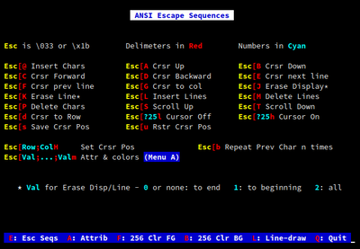
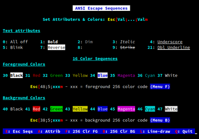
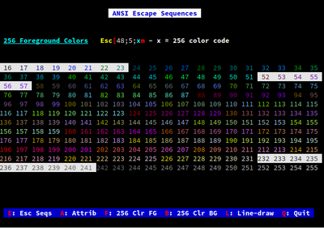
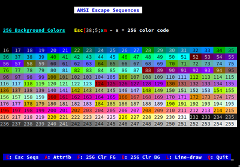
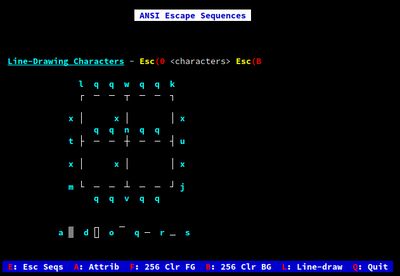
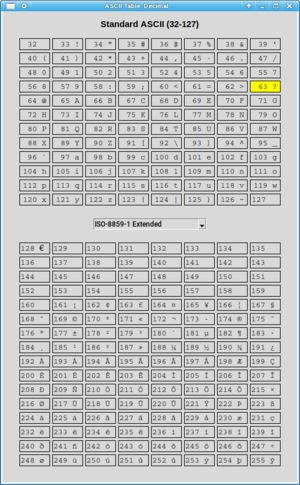
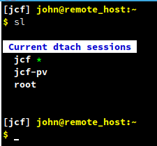
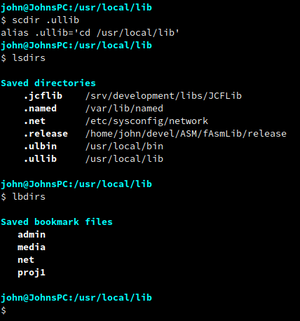
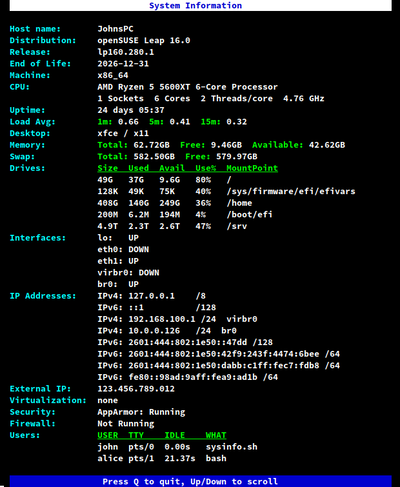
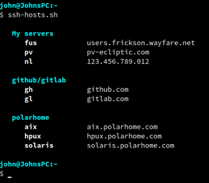

# John's Scripts #

## Introduction ##

This is a collections of some of my scripts that I thought might be usable
by some people other than myself.

## Table of Contents ##

- [Modules](#modules)
- [Scripts](#scripts)
  - [ansi.sh](#ansish)
  - [ascii.py](#asciipy)
  - [dtach-ctl.sh](#dtach-ctlsh)
  - [svdir](#svdir)
  - [sysinfo.pl](#sysinfpl)
  - [ssh-hosts.pl](#ssh-hostspl)
  - [Date & Time Utilities](#date--time-utilities)

---------------------------------------------------------------------------

## Modules ##

A lot of my scripts add color to make things stand out more, or to highlight
warnings and errors. For that reason, I have centralized ANSI escape sequences.
Put these in `~/.local/lib`

* [`.local/lib/bash/Ansi`](.local/lib/bash/Ansi) - a collections of ANSI codes for bash scripts
    - Include in your scripts by using these lines:
        ```bash
        PATH="${HOME}/.local/lib/bash:${PATH}"
        source Ansi
        ```

* [`.local/lib/perl/Ansi.pm`](.local/lib/perl/Ansi.pm) - a collections of ANSI codes for perl scripts
    - Include in your scripts by using these lines:
        ```perl
        use lib glob("~/.local/lib/perl");
        use Ansi qw(:DEFAULT);
        ```

* [`.local/lib/python3.13/site-packages/ansi.py`](.local/lib/python/ansi.py) - a collections of ANSI codes for python scripts
    - Include in your scripts by using these lines:
        ```python
        import sys
        import os
        sys.path.append(os.path.expanduser("~/.local/lib/python"))
        from ansi import *
        ```


## Scripts ##

---------------------------------------------------------------------------
### [ansi.sh](other/ansi.sh) ###
A bash script that shows selected ANSI escape codes on the screen for easy
reference.

| **Escape Page**                | **Attributes Page**            |
|--------------------------------|--------------------------------|
|          |          |
| **256 Foreground Colors Page** | **256 Background Colors Page** |
|          |          |
| **Line-draw Page**             |                                |
|          |                                |


---------------------------------------------------------------------------
### [ascii.py](other/ascii.py) ###
A python/tkinter script that shows ASCII codes for reference.

The top half shows
the standard 7-bit ASCII characters. Pressing a key on the keyboard will
highlilght that character. Pressing the left or right cursor keys will change
the numbers between decimal, octal, and hex.

The bottom half shows extended ASCII characters. There are quite a few sets of
extended ASCII, and the dropdown gives you the option of showing four of the
most popular sets: ISO-8859-1, CP437, CP1252, and MacRoman.

- **ASCII Table**  
  


---------------------------------------------------------------------------
### [dtach-ctl.sh](dtach-ctl/dtach-ctl.sh) ###
I needed a program that would give me a persistent remote terminal on a server
at work, because the connection would drop and the worst possible times. I also
wanted something that would let me have multiple sessions active in the same
terminal and be able to switch between them.

What about _screen_ or _tmux_ you ask? They both have too many "features" that
I neither want nor need, some of which actually get in the way. They intercept
too many scancodes, put a status line on the bottom, prevent me from copying
text on the terminal by selecting it with the mouse, and so on.

So I tried [dtach](https://github.com/crigler/dtach). It was extremely simple,
did the job without any problems or "features", and only watched for one
scancode - `Ctrl+\` - which is redifinable. The only thing missing was simple
multiplexing. I wrote the `dtach-ctl.sh` script to take care of that.

#### How to ####
* Copy `dtach-ctl.sh` to your `~/bin` directory.
* Copy `s`, `sc`, `sk`, `sl`, and `sw` to your `~/bin` directory using `cp -d` to keep it as a symlink.
* Download [the dtach source](https://github.com/crigler/dtach/archive/refs/heads/master.tar.gz) tarball (or use the `.zip` extension if you prefer zip.)
* Extract the contents
* cd into the `dtach-master` directory and run `./configure && make && cp dtach ~/bin`. There's also a man-page (dtach.1) if you want it.
* Edit your `~/.bashrc`. Add the lines<br>
`export PS1="\e[1m[$DTACH_SESSION] $PS1"`<br>
`complete -W '$(ls -1 -I ".*" /home/<YOUR_USER_ID>/.dtach 2>/dev/null) s sk sw`
<br>
after your `PS1` is set. These lines will show the session name in `PS1` and
supply tab-completion for the `s, `sk`, and `sw` commands.

* Edit `~/bin/dtach-ctl.sh`. Set the `DTACH_DIR` variable, and add any entries to the `feed_keys` array.
* Run `source ~/.bashrc` to pick up the changes.
* Run `dtach-ctl.sh` or `s -h` to get a quick list of how to use it.
* Enter `s session1` or whatever you want to call your session. For the example below, I ran `s jcf`, then `Ctrl+\` to detach, `s jcf-pv`, then `Ctrl+\`, then `s root` to create three sessions. Then `sw jcf-pv` to switch to the `jcf-pv` session, the `sl` to list current sessions. Your active session shows with `*` after it.

- **dtach-ctl Sessions**  
  


---------------------------------------------------------------------------
### [svdir](svdir/svdir) ###
I often need to change to multiple directories, sometimes eight or more. I could
(and did) use `pushd /some/very/long/path/name` and `pushd +1`, etc. to switch,
or curser up or search history, or type or paste in the long `cd` commands. No
matter how you do it, it's a real pain.

So I wrote `svdir`. Now, I one time do something like `cd /srv/develop/group-a/myproj`, then type `scdir`. That creates an alias: `alias .myproj='cd /srv/develop/group-a/myproj`. (It will default to the current directory name, but you can also give it a different name, like `scdir .dev`) So the next time I need to switch to that directory, I just enter `.myproj` (or `.dev`) and I'm there. Do that
for each directory, and you'll have a full set of paths defined as aliases.
Then you can save the aliases in a bookmark file using `sbdirs projdirs`.
Then next time you need that set, enter `lddirs projdirs` and all your aliases
are back, ready to use.

- **svdir Usage**  
  


---------------------------------------------------------------------------
### [sysinfo.pl](other/sysinfo.pl) ###
I often need (or want) to see information about a system I'm working on. How
much memory does it have? How big are the drives? What are the details about
the CPU? What about the network, security, virtualization?

I wrote, and over time enhanced a script to show me a bunch of things I wanted
to see about whatever system I'm on. This is the result.

- **System Information**  
  


---------------------------------------------------------------------------
### [ssh-hosts.pl](other/ssh-hosts.pl) ###
This is a little convenience script to list the hosts in my `~/.ssh/config`
file. The hosts can be in groups. A group starts with lines like this:  
```
  #---------------------------
  # Github/Gitlab
  #---------------------------
  Host gh
      HostName     github.com
      IdentityFile id_git

  Host gl
      HostName     gitlab.com
      IdentityFile id_git
```

The dashes are require both before and after the group name, but the number
of dashes doesn't matter -- as long as there's at least one dash.

- **SSH Host Listing**  
  


---------------------------------------------------------------------------
### [Date & Time Utilities](date-time) ###
Some things I wrote that sometimes come in handy.

* [`date2ts.sh`](date-time/date2ts.sh) - Alone, gives the current timestamp. Or include a date string, and it will convert that to a timestamp.
* [`ts2date.sh`](date-time/ts2date.sh) - The reverse of `date2ts.sh`
* [`elapsed.sh`](date-time/elapsed.sh) - Give it a starting and optional ending date, and it will display the elapsed time.

```
    $ date2ts.sh
    timestamp is: 1777136294

    $ date2ts.sh "Mar 12, 2010 17:00"
    timestamp is: 1268434800

    $ ts2date.sh 1268327460
    date is: 2010-03-11 11:11:00

    $ elapsed.sh "Mar 12, 2010 17:00"
    elapsed time is: 5887 Days 17:58:25

    $ elapsed.sh "Mar 31, 2026" "Apr 1, 2026"
    elapsed time is: 1 Day 00:00
```
